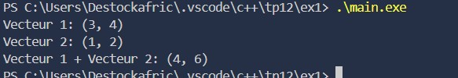
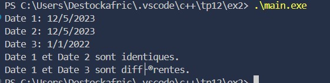
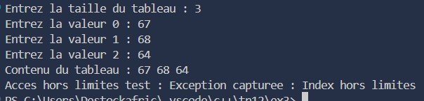
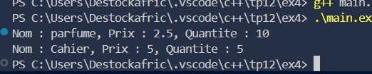

### Exercice 1 : Surcharge de l’opérateur + pour Vecteur2D

#### Objectif  
Implémenter la surcharge de l’opérateur `+` pour additionner deux vecteurs à 2 dimensions.

#### Description  
- Création d’une classe **Vecteur2D** avec deux attributs privés `x` et `y`.  
- Ajout d’un constructeur pour initialiser ces valeurs.  
- Surcharge de l’opérateur `+` pour retourner un nouveau vecteur résultant de l’addition.  
- Méthode `afficher()` pour imprimer les composantes du vecteur.  
- L’utilisateur peut créer et additionner plusieurs vecteurs.

#### Fonctionnalités  
- Surcharge de l’opérateur `+`.  
- Gestion des objets via des méthodes de classe.  
- Affichage clair du résultat de l’addition.

#### Résultat  

---

### Exercice 2 : Surcharge des opérateurs == et != pour une classe Date

#### Objectif  
Comparer deux dates avec surcharge des opérateurs.

#### Description  
- Création d’une classe **Date** avec les attributs `jour`, `mois`, et `annee`.  
- Constructeurs pour initialiser les objets.  
- Surcharge de `==` pour vérifier l’égalité et `!=` pour vérifier la différence.  
- Le programme principal compare deux objets Date et affiche le résultat.

#### Fonctionnalités  
- Surcharge des opérateurs de comparaison.  
- Vérification simple et intuitive de l’égalité/différence des dates.  
- Utilisation de méthodes adaptées pour les objets personnalisés.

#### Résultat  

---

### Exercice 3 : Surcharge de l’opérateur [] pour un tableau dynamique

#### Objectif  
Simuler un tableau d’entiers avec un accès indexé sécurisé.

#### Description  
- Création d’une classe **Tableau** avec un pointeur dynamique vers `int* data` et la taille.  
- Initialisation du tableau dans un constructeur.  
- Surcharge de l’opérateur `[]` pour accéder aux éléments avec gestion des bornes.  
- Lancement d’une exception si un index invalide est fourni.  
- Destructeur pour libérer la mémoire allouée.

#### Fonctionnalités  
- Accès sécurisé aux éléments via l’opérateur `[]`.  
- Gestion dynamique de la mémoire.  
- Prévention des erreurs d’indexation grâce aux exceptions.

#### Résultat  

---

### Exercice 4 : Surcharge de l’opérateur << pour la classe Produit

#### Objectif  
Personnaliser l’affichage d’un objet avec `std::cout`.

#### Description  
- Création d’une classe **Produit** avec les attributs : `nom`, `prix`, `quantite`.  
- Constructeur pour initialiser les données.  
- Surcharge de l’opérateur `<<` comme fonction amie pour permettre l’affichage direct avec `std::cout`.  
- Le programme affiche les informations des produits de manière lisible et standardisée.

#### Fonctionnalités  
- Surcharge de l’opérateur d’insertion `<<`.  
- Affichage clair et formaté des objets.  
- Intégration facile avec `std::cout`.

#### Résultat  

